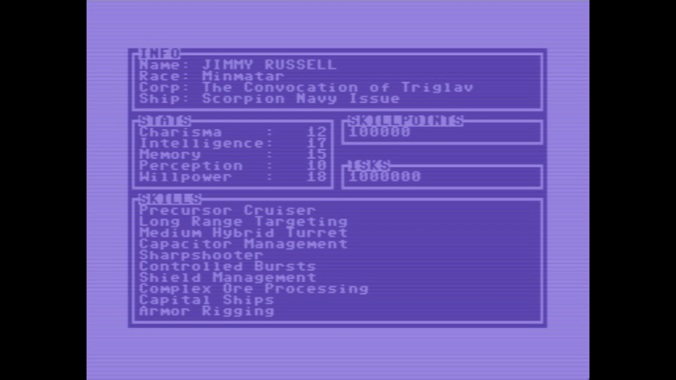

# EVE 64

EVE QUEST : a game to celebrate EVE's 20th Anniversary !

---
## THE GAME
---
EVE64 is a clone of the famous game Progress Quest set in the universe of EVE Online for the Commodore 64 !!!

- Over 250 Corps
- Over 250 items to loot
- Over 300 missions to run
- Over 350 ships to fly
- Over 350 skills available
- Over 1200 systems to explore !!!

---
## NOTE
---
The game is inspired by the famous game Progress Quest (https://en.wikipedia.org/wiki/Progress_Quest).

All the literal informations presented on this site about EVE Online and its trademarks are property of CCP (https://www.ccpgames.com). 

This program is not produced by, endorsed by, supported by, or affiliated with CCP.
